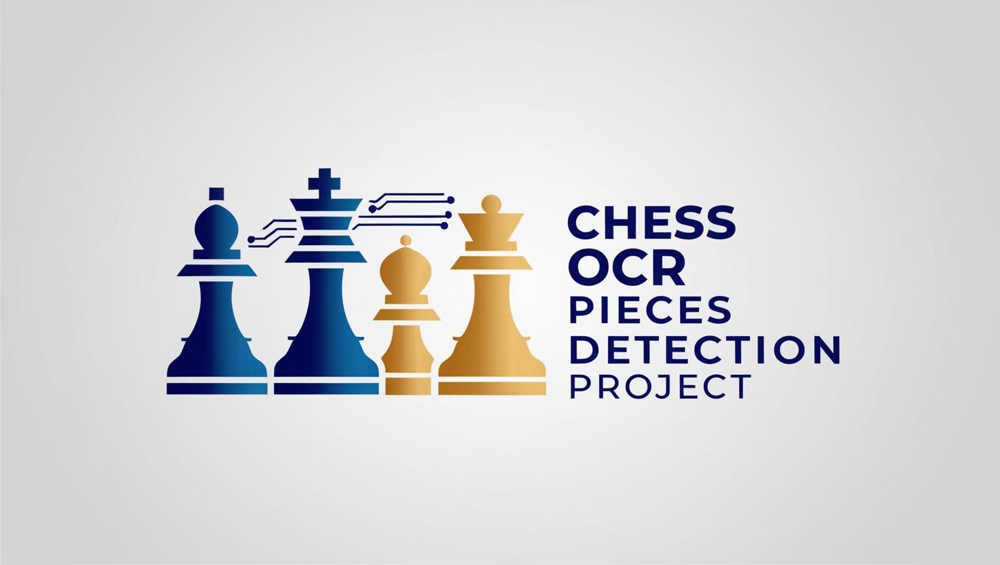

# Chess-OCR-pieces-detection

Chess OCR and Detection Project Overview
This project involves the development of an OCR-based chessboard position detection system using YOLOv8 for chess piece detection. Here's a step-by-step breakdown of the process:

Data Collection:

Download about 1M chess games from Lichess (July 2014 dataset).

Use the python-chess package to extract 60k positions from the games.

Generate approximately 190k images from these positions for training.

Label Generation:

Create a CSV file containing the FEN (Forsyth-Edwards Notation) for each image.

Image Annotation:

Annotate 64k images by generating bounding boxes for each piece on the chessboard.

For each image, generate a text file with the bounding box coordinates for the respective chess pieces.

YOLOv11 Training:

Train the YOLOv11 model on the annotated dataset to detect chess pieces accurately.

You can check the training logs in the run_logs.txt file to see the model's performance.

Testing on Extracted Chess Book Images:

Extract chessboard images from a PDF chess book (one example is included).

Test the trained model on these extracted images and visualize the chess positions on Lichess to analyze positions and find the best move.

Model Performance Notes:

While the model performs well, sometimes it may confuse black king and white king, especially when the extracted image quality is low.

Image enhancement using OpenCV can help improve detection accuracy.

Skip the first 3 steps?
You can directly download the pre-annotated dataset I uploaded to HuggingFace, which is ready for training.

